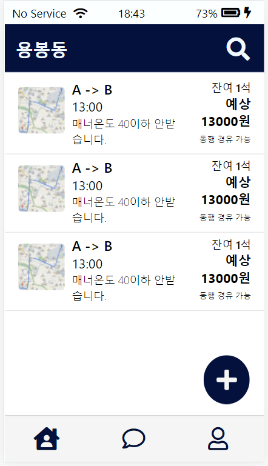
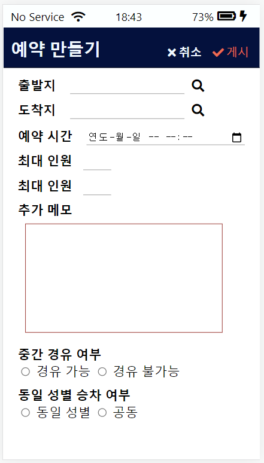
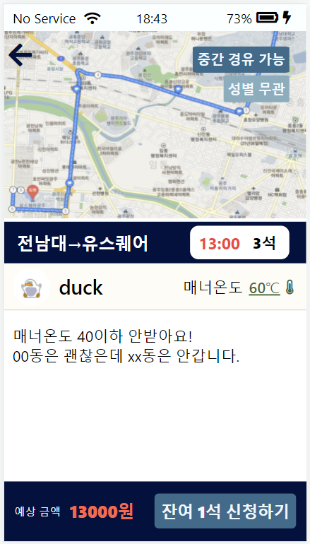

# 타부러

> **호남지역의 이동 불편을 개선하기 위해 기획한 모바일 웹 기반 카풀 서비스**

제2회 OASIS 해커톤에서 4명이 함께 만든 프로젝트입니다.

출발지와 목적지가 비슷한 사용자가 함께 이동할 수 있도록 카풀 탐색·등록·상세 조회·참여 기능을 구현하고, **TMAP 경로 API**를 활용해 출발지와 도착지 사이의 이동 경로를 지도에 시각화했습니다.

---

## 프로젝트 정보

| 항목 | 내용 |
| --- | --- |
| 개발 기간 | 2021.08.09 ~ 2021.08.20 |
| 프로젝트 | 제2회 OASIS 해커톤 |
| 팀 구성 | 4명 |
| 담당 역할 | Frontend |
| 서비스 형태 | 모바일 웹 |

---

## 주요 기능

- 카풀 목록 조회 및 조건 검색
- 카풀 등록 및 상세 조회
- 카풀 참여·취소 및 모집 상태 관리
- 로그인·회원가입·프로필 관리
- TMAP 기반 출발지·도착지 및 이동 경로 확인

---

## 담당 역할

- HTML/CSS 기반 모바일 웹 UI 구현
- 사용자 **프로필 화면 UI 및 CSS 직접 구현**
- Frontend 팀원들과 카풀 탐색·등록·상세 화면 공동 구현
- TMAP 경로 API 연동 및 지도 시각화 공동 작업
- Rails ERB View와 Frontend 화면 통합 참여
- Slack 및 Git/GitHub 기반 4인 팀 협업

---

## 핵심 구현

### 1. 모바일 카풀 서비스 UI

HTML5, CSS3, JavaScript, jQuery를 활용해 모바일 환경에 맞춘 **카풀 탐색·등록·상세 조회 및 사용자 프로필 화면**을 구현했습니다.

초기 정적 Frontend 화면은 `FE/`에서 확인할 수 있으며, 일부 화면은 Rails의 ERB View에 적용하여 서버 데이터와 사용자 상태가 화면에 반영되도록 통합했습니다.

### 2. TMAP 경로 API 연동

Frontend 팀원과 함께 **TMAP JavaScript API와 경로 탐색 API**를 연동했습니다.

경로 탐색 결과의 `features[]`에서 거리·시간·경로 좌표를 처리하고, EPSG3857 경로 좌표를 WGS84 좌표로 변환한 뒤 Marker와 Polyline을 생성하여 이동 경로를 지도에 시각화했습니다.

```text
출발 · 도착 좌표 (WGS84)
        ↓
TMAP 경로 API 요청
        ↓
Response / features[]
        ↓
거리 · 시간 · 경로 좌표 추출
        ↓
EPSG3857 → WGS84 좌표 변환
        ↓
Marker · Polyline 생성
        ↓
지도 시각화
```

> **구현 범위** — 시연용 출발·도착 좌표(WGS84)를 기준으로 경로 탐색 및 지도 시각화를 구현했으며, 사용자 입력 주소의 좌표 변환은 구현 범위에 포함하지 않았습니다.

### 3. Rails View 통합

HTML/CSS/JavaScript로 제작한 정적 화면을 Rails의 **ERB View에 적용**하고, `@ride`, `current_user` 등의 서버 데이터를 활용하여 카풀 정보와 사용자 상태에 따른 화면을 구성했습니다.

Rails Route 및 Form과 화면을 연결하면서 Frontend와 Backend가 하나의 사용자 흐름으로 동작하도록 통합했습니다.

---

## 서비스 화면

| **카풀 목록** | **카풀 등록** | **카풀 상세 · 경로 조회** |
| :---: | :---: | :---: |
|  |  |  |
| 등록된 카풀 목록 조회 및 출발지·도착지·날짜 조건을 통한 카풀 탐색 | 출발지·목적지·출발 시간 등 카풀 모집에 필요한 정보 등록 | 카풀 모집 정보 확인 및 TMAP을 활용한 출발지·도착지 이동 경로 조회 |

---

## 기술 스택

| 구분 | 기술 |
| --- | --- |
| Frontend | HTML5, CSS3, JavaScript, jQuery |
| Backend / Template | Ruby on Rails 6.1, ERB, Devise |
| Database | SQLite |
| External API | TMAP JavaScript API, TMAP 경로 탐색 API |
| Collaboration | Slack, Git, GitHub |

---

## Repository 구조

```text
tabureo-carpool/
├── FE/                     # 초기 정적 Frontend
│   ├── css/
│   ├── js/
│   └── *.html
│
├── app/
│   ├── controllers/        # Rails Controller
│   ├── models/             # Rails Model
│   └── views/              # ERB View
│       ├── rides/
│       ├── history/
│       ├── users/
│       ├── devise/
│       └── chats/
│
├── config/                 # Rails 및 Route 설정
├── db/                     # Database 설정
├── docs/
│   └── images/             # README 화면 자료
│
├── Gemfile
└── README.md
```

---

## 개발 환경

본 Repository는 **2021년 해커톤 당시 개발 환경과 구현 결과를 기준으로 보존한 프로젝트**입니다.

| 구분 | 환경 |
| --- | --- |
| Ruby | 2.7 |
| Ruby on Rails | 6.1 |
| Database | SQLite |
| Frontend | HTML5, CSS3, JavaScript, jQuery |
| External API | TMAP JavaScript API, TMAP 경로 탐색 API |

현재 서비스 배포 및 실행 환경을 별도로 운영하고 있지 않습니다.

---

## 구현 범위

- 핵심 카풀 탐색·등록·상세 및 참여 흐름은 Rails와 연결되어 있습니다.
- 로그인·회원가입·프로필 등의 사용자 기능은 Devise/Rails와 연결되어 있습니다.
- 일부 채팅 및 부가 기능은 UI 프로토타입 단계입니다.
- TMAP 상세 화면은 시연용 고정 좌표를 기반으로 경로를 조회합니다.
- Repository는 당시 프로젝트 구조와 구현 결과를 유지하며 공개에 필요한 설정만 정리했습니다.
