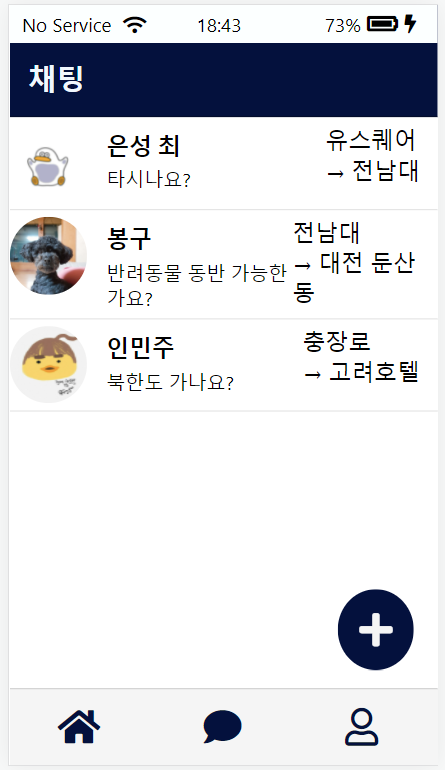
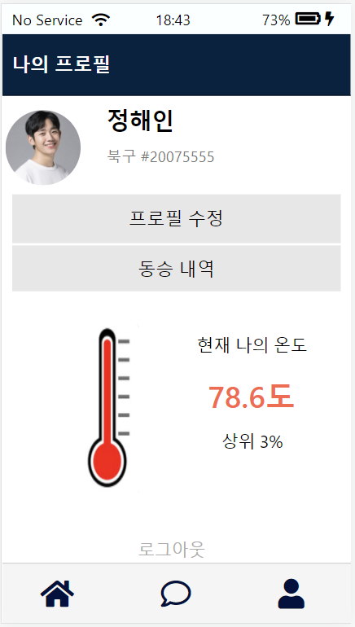
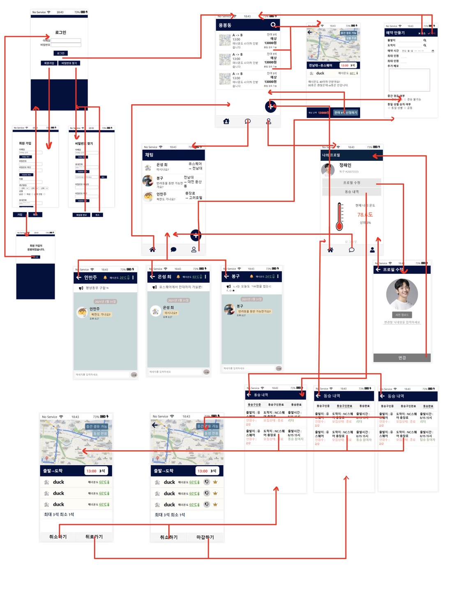

# 타부러

> HTML, CSS, JavaScript로 모바일 카풀 서비스를 구성한 2021년 해커톤 팀 프로젝트입니다.
> 화면 구현을 중심으로 참여하며 TMAP API 공동 연동, Rails template 연결, Git 협업 과정을 경험한 첫 웹 팀 프로젝트입니다.

## Project Overview

타부러는 출발지와 목적지가 비슷한 사용자가 함께 이동할 수 있도록 기획한 지역 기반 카풀 예약 프로토타입입니다. 호남 지역의 제한적인 대중교통 선택지와 지역 커뮤니티의 택시 동승 모집 사례에서 출발했습니다.

| 항목 | 내용 |
| --- | --- |
| 프로젝트 | 타부러 |
| 형태 | 2021년 해커톤 팀 프로젝트 |
| 팀 구성 | 4명 |
| 담당 | Frontend UI 중심 |
| 화면 기준 | 모바일 웹, Galaxy S5 viewport |
| Frontend | HTML5, CSS3, JavaScript, jQuery |
| Backend / Template | Ruby on Rails, ERB, Devise, SQLite |
| External API | TMAP JavaScript API, TMAP 경로 탐색 API |

## My Role

- 주요 모바일 화면의 HTML 구조와 CSS 스타일 구현
- 카풀 등록·상세·모집 상태 관련 UI 제작
- 채팅 목록·채팅방과 프로필 화면 prototype 구현
- JavaScript/jQuery를 활용한 화면 interaction 작업
- 정적 Frontend 화면을 Rails ERB template에 적용하는 과정에 참여
- TMAP 지도·경로 기능 공동 연동 및 이후 공개용 API key 설정 정리

Rails Backend와 데이터 처리는 다른 팀원이 주로 담당했습니다.

## Key Features

| 기능 | 구현 수준 |
| --- | --- |
| 카풀 목록, 출발지·도착지·날짜 검색, 등록 | Rails Backend 연결 |
| 로그인, 회원가입, 프로필 수정 | Devise / Rails Backend 연결 |
| 참여 이력, 모집 취소·마감, 동성 전용 모집, 중간 경유 | Rails Backend 연결 |
| 카풀 상세, 참여 신청, 강제 퇴장, 매너 온도 | 일부 Backend 연결 |
| 채팅 목록·채팅방, 리더 양도, 일부 정적 회원 흐름 | UI Prototype |

저장소의 `FE/`는 정적 HTML/CSS 프로토타입이고, `app/views/`는 이 화면 구조의 일부를 Rails ERB와 연결한 결과입니다. 모든 정적 UI가 Backend 기능으로 완성된 것은 아닙니다.

## TMAP API Integration

팀원과 함께 TMAP JavaScript SDK와 경로 탐색 API를 연결해 이동 경로를 상세 화면에 표현했습니다.

- 출발지·도착지 marker 표시
- 경로 탐색 API 요청과 response 처리
- EPSG3857 좌표를 WGS84 지도 좌표로 변환
- Polyline으로 경로 시각화
- 이동 거리·시간·예상 요금을 UI에 표시

공개 archive를 정리하며 기존 API key hardcoding을 제거하고, 정적 화면은 local config, Rails 화면은 환경변수로 key를 분리했습니다. key가 없으면 SDK와 API를 호출하지 않습니다. Rails 상세 화면의 지도는 DB에 좌표 field가 없어 당시 demo 좌표를 사용합니다.

## Screens & Wireframe

화면 자료는 2021년 해커톤 당시 구현 결과를 기준으로 구성했습니다.

### 카풀 탐색과 등록

  
  
  

### Prototype UI

  
  

### Design & Flow

해커톤 당시 모바일 화면 흐름과 주요 UI를 정리한 자료입니다.

## Tech Stack

| 영역 | 기술 |
| --- | --- |
| Frontend | HTML5, CSS3, JavaScript, jQuery 3.2.1 |
| Backend / Template | Ruby 2.7, Ruby on Rails 6.1, ERB, Devise |
| Database | SQLite |
| External API | TMAP JavaScript API, TMAP 경로 탐색 API |
| Collaboration | Git, GitHub |

## What I Learned

### HTML/CSS/JavaScript의 실제 적용

정적 연습을 넘어 여러 화면과 사용자 흐름을 가진 웹 프로젝트를 처음 구현했습니다. 모바일 기준의 배치와 상태별 UI를 HTML과 CSS로 구성하고 JavaScript/jQuery로 화면 동작을 연결했습니다.

### 첫 Git 팀 협업

4명이 화면, 지도, Backend 영역을 나누어 작업하고 Git/GitHub에서 각자의 결과를 합치는 과정을 경험했습니다.

### Frontend와 Backend의 연결

`FE/`에서 만든 정적 화면을 Rails ERB template에 적용하고 controller/model의 데이터가 화면에 표시되는 과정을 경험했습니다.

### External API 활용

지도 SDK와 경로 API의 좌표·경로·요금 데이터를 marker, Polyline, 텍스트 UI로 변환하는 흐름을 경험했습니다.

### Archive Cleanup

공개 archive 정리 과정에서 API key hardcoding, 잘못된 화면 field, legacy GET delete route 등 명백한 오류와 공개 안전성 문제만 최소 범위로 정리했습니다.

## Limitations

- 일부 화면과 interaction은 UI prototype으로만 구현되었습니다.
- 채팅과 리더 양도는 실제 Backend 기능이 아닙니다.
- Rails TMAP 상세 화면은 실제 모집글 주소가 아닌 고정 demo 좌표를 사용합니다.
- 2021년 당시 모바일 화면을 기준으로 설계해 현대적인 responsive layout과 차이가 있습니다.
- Backend는 다른 팀원이 주로 담당했으며, archive 정리 과정에서 Rails 실행 환경을 별도로 재현하지는 않았습니다.

## Team & Credits

| 영역 | 담당 |
| --- | --- |
| 화면 구조 (HTML) | 노수지, 고민주, 최은성 |
| 화면 스타일 (CSS) | 노수지, 고민주 |
| TMAP API 화면 연동 | 고민주, 최은성 |
| Rails Backend·데이터 처리 | 정효인 |
